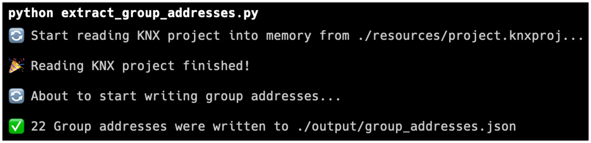
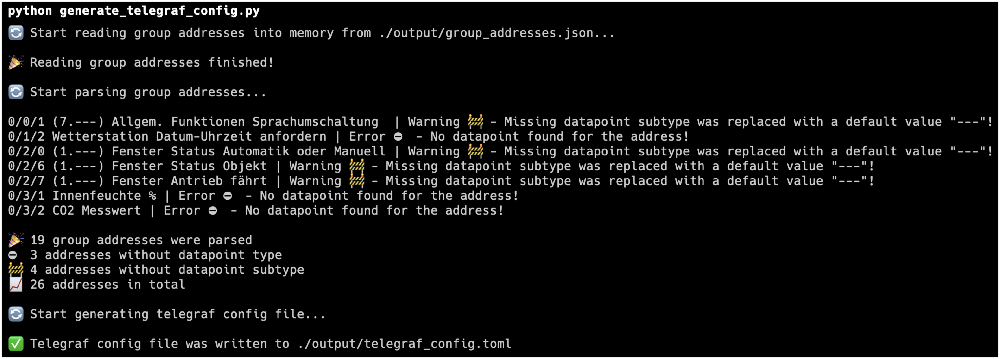

# KNX Telegraf Config Generator

This project automates the generation of configuration for Telegraf's [KNX Input Plugin](https://github.com/influxdata/telegraf/blob/master/plugins/inputs/knx_listener/README.md), utilizing your KNX project directly, in order to easily ingest metrics from KNX event bus and build real-time dashboards on top of Grafana or InfluxDB UI.

## Why

It's not uncommon for [KNX projects](https://www.knx.org/knx-en/for-your-home/real-life-examples/) to have hundreds or thousands of devices and manually managing the configuration can be an arduous task.

## Getting started

### Pre-requirements

- python 3
- pip

### Installation

```bash
# install dependencies
pip install -r requirements.txt
```

### Preparation

1. Copy your `knx_project_ets6.knxproj` to `./resources/project.knxproj`
2. Adjust settings in [config.py](./config.py) if necessary
   - Possibility to change KNX interface type and address
   - Possibility to ignore group address by address, address prefix, dpt type, dpt type prefix
   - Possibility to ignore missing dpt subtypes or replace missing subtype with a [default value](https://github.com/svsool/knx-influx-config-generator/blob/ee158faaceedc5c9129db6b17a41241860b72ec8/config.py#L11)

### Run Config Generator

```bash
# parses KNX project and writes group addresses to ./output/group_addresses.json
python extract_group_addresses.py

# ingests group addresses and writes KNX Input Plugin config to ./output/telegraf_config.toml
python generate_telegraf_config.py
```

## Example

The `./resources/project.knxproj` file contains a sample project that can serve as a demonstration.

### Group Addresses




```json
// ./output/group_addresses.json
[
   {
      "name": "Fenster Sicherheit",
      "identifier": "GA-18",
      "raw_address": 520,
      "address": "0/2/8",
      "dpt_type": {
         "main": 1,
         "sub": 1
      },
      "communication_object_ids": [],
      "description": ""
   },
   {
      "name": "Fenster Automatik Sperre",
      "identifier": "GA-19",
      "raw_address": 521,
      "address": "0/2/9",
      "dpt_type": {
         "main": 1,
         "sub": 1
      },
      "communication_object_ids": [],
      "description": ""
   },
   {
      "name": "Innentemperatur °C",
      "identifier": "GA-20",
      "raw_address": 768,
      "address": "0/3/0",
      "dpt_type": {
         "main": 9,
         "sub": 1
      },
      "communication_object_ids": [],
      "description": ""
   }
]
```

### Telegraf Config



```toml
# ./output/telegraf_config.toml
[[inputs.knx_listener]]
service_type = "router"
service_address = "224.0.23.12:3671"
[[inputs.knx_listener.measurement]]
name = "Fenster Sicherheit"
addresses = [ "0/2/8" ]
dpt = "1.001"

[[inputs.knx_listener.measurement]]
name = "Fenster Automatik Sperre"
addresses = [ "0/2/9" ]
dpt = "1.001"

[[inputs.knx_listener.measurement]]
name = "Innentemperatur °C"
addresses = [ "0/3/0" ]
dpt = "9.001"
```
